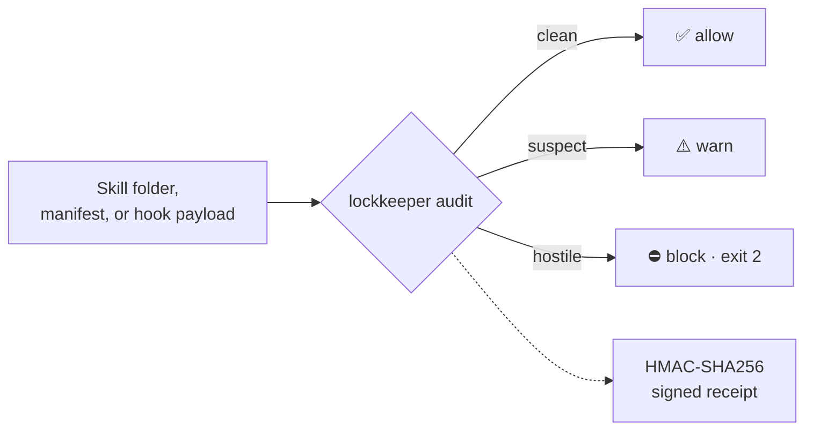

# Lockkeeper 🔒

[](https://www.python.org/downloads/)
[](LICENSE)
[](#development)

**The capability router and prompt-injection firewall for AI coding agents.**

Lockkeeper indexes every skill, MCP server, plugin, tool, agent, and command installed across your coding agents (Claude Code, Codex, Cursor, Jcode, Hermes, OpenCode, Gemini, Copilot, Windsurf, Cline). It routes any task to a bounded portfolio of the right capabilities and screens everything that crosses your agent's boundary with a built-in injection firewall.

> Your agent doesn't need all your installed capabilities in context.
> It needs the right 8, verified safe, for *this* task.

**Built and maintained by [Himanshu (@Hannay001)](https://github.com/Hannay001).** Contributions welcome. If Lockkeeper saves you context, a ⭐ helps other people find it.

<p align="center">
  
  <br><sub><b>1 · Route</b> — one query, a bounded portfolio instead of the whole toolbox</sub>
</p>
<p align="center">
  
  <br><sub><b>2 · Catch</b> — the firewall flags an injection attack; exit codes gate installs and CI</sub>
</p>
<p align="center">
  
  <br><sub><b>3 · Prove</b> — HMAC-signed receipts show evidence wasn't altered after the scan</sub>
</p>

```console
$ lockkeeper route --runtime claude --stdin <<'TASK'
migrate the auth module to the new token API
TASK

status: success
summary: selected 6 complementary capabilities across 4 lanes
[context] mcp: context7
[primary] skill: api-migration
[integration] tool: mcp__context7__query_docs
[execution] tool: exec_command
[verification] agent: code-reviewer
[support] skill: python-patterns
context savings: loaded 6 of 7,540 eligible capabilities (7,534 kept out of context)
```

Every route ends with that `context savings` line so the value is visible, not just claimed.

Exact entries depend on what you have installed. What `lockkeeper` guarantees is the structure: complementary lanes, a hard cap on portfolio size, and every entry filtered to what that runtime can actually execute. Add `--savings` to also estimate the skill-body tokens kept out of your prompt, and see [Proof: your prompt stays flat as your toolbox grows](#proof-your-prompt-stays-flat-as-your-toolbox-grows) for real, reproducible numbers.

## How it works


One index spans every harness on your machine. Queries refresh stale registries automatically, invalid config fails loudly instead of guessing, and each runtime receives only capabilities it can genuinely execute.

## Why

Agent capability directories are exploding:

- Three MCP servers can eat 140k tokens before real work starts.
- Copied skills ship hidden instructions nobody reads.
- Existing tools manage *servers*; none route *tasks* across *all* installed capabilities, and none screen what you install.

Lockkeeper is the missing layer between your task and your toolbox:

| Layer | Command | Status |
|---|---|---|
| Index and inventory | `lockkeeper rebuild`, `lockkeeper check` | ✅ shipped |
| Task routing | `lockkeeper search`, `lockkeeper route` / `bundle` | ✅ shipped |
| Context-savings report | `lockkeeper route --savings` | ✅ shipped |
| Prompt-injection firewall | `lockkeeper audit`, `lockkeeper hook` | ✅ shipped (static + live) |
| Signed audit receipts | `--receipt-out` / `--verify-receipt` | ✅ shipped |
| Dependency CVE gate | `--check-deps` (osv.dev) | ✅ shipped |
| Install and lock | `lockkeeper install`, `cap.lock` | 🔜 roadmap |
| Remote discovery | `lockkeeper search --remote` | 🔜 roadmap |

See [ROADMAP.md](ROADMAP.md) and [docs/ARCHITECTURE.md](docs/ARCHITECTURE.md).

## The firewall

Every capability folder, plugin manifest, MCP config, and live tool call can pass through `lockkeeper audit`: a dependency-free static scanner with verdicts you can gate on.



It detects instruction-override phrasing, exfiltration pipelines (secrets → curl/wget/nc), credential-store access, obfuscated execution (`base64 -d | sh`), destructive commands, hidden directive comments, and invisible or homoglyph Unicode. Executable payloads (`.pyc`, `.so`, `.dll`, `.wasm`) inside an audited directory can't be text-scanned, so they're hashed and floored to at least `suspect`: a skill that ships bytecode never audits clean.

Verdicts map to CI-friendly exit codes (`clean` / `suspect` / `hostile` → `0` / `1` / `2` under `--strict`). Every JSON finding carries a SkillTrustBench `taxonomy` tag (T01–T09) so results stay comparable across skill-security tooling. With `--check-deps`, pinned dependencies are checked against osv.dev; with `--llm-scan` (opt-in twice: flag plus environment variables), an OpenAI-compatible endpoint adds a second-pass review that the offline scanner never depends on.

### Verifiable evidence

```sh
lockkeeper audit ~/skills/some-skill --recursive --strict \
  --receipt-out receipt.json --receipt-key key.hex
# later, prove nothing was altered:
lockkeeper audit --verify-receipt receipt.json --receipt-key key.hex   # exit 0 valid, 1 tampered
```

Receipts bind to the requested targets and the paths actually scanned, so they're evidence, not decoration. Useful as CI artifacts and audit trails.

### Watching live tool calls

Beyond static files, register the firewall as a Claude Code hook and hostile tool calls are blocked before execution:

```json
{
  "hooks": {
    "PreToolUse": [{ "command": "lockkeeper hook", "timeout": 5000 }]
  }
}
```

Works with any harness that supports stdin JSON hooks (Claude Code, Codex, ...).
The live hook fails closed on oversized input and on any `high` or `critical`
finding. Medium-only `suspect` traffic is allowed with a warning to avoid turning
low-confidence signals into a noisy execution blocker.

## Install

### Way 1 — no terminal skills required (one paste)

Copy the prompt in [PROMPT.md](PROMPT.md) and paste it into any AI coding agent you already have. It installs Lockkeeper, binds it to every harness it finds on your machine, builds the index, and reports back in plain language.

### Way 2 — terminal, zero manual wiring

```sh
git clone https://github.com/Hannay001/lockkeeper.git
cd lockkeeper
./install.sh        # symlinks `lockkeeper`, then auto-detects and binds every harness on this machine
lockkeeper snapshot-runtimes
lockkeeper rebuild
lockkeeper doctor          # shows each bound harness and its skill count
```

The installer scans for Claude Code, Codex, Cursor, Jcode, Hermes, OpenCode, Gemini, Copilot, Windsurf, Cline, plus anything unknown that looks like an agent harness under your home directory. Bindings land in `config/local.toml` (git-ignored, machine-local).

```sh
CAP_RUNTIMES=claude,codex ./install.sh   # bind only these two
CAP_NO_INIT=1 ./install.sh               # install without auto-binding
```

### Way 3 — pip install (wheel)

```sh
pip install git+https://github.com/Hannay001/lockkeeper.git
lockkeeper doctor   # entry points: lockkeeper, lockkeeper-audit, lockkeeper-hook
```

This installs the CLI from the packaged wheel (CI builds and functionally smokes it on every push, including Windows). Harness auto-binding still uses `install.sh` or `lockkeeper init`.

### Route and audit in 30 seconds

```sh
# Route a task from any bound harness's perspective
lockkeeper route --runtime claude --stdin --max 8 <<'CAPABILITY_QUERY'
audit our payment webhook for race conditions
CAPABILITY_QUERY

# Audit any skill folder before installing it
lockkeeper audit ~/Downloads/some-skill --recursive --strict
```

## Configuration

Structural paths come from `config/default.toml`; add per-project overlays as `config/<name>.toml` and select them with `--project <name>`. Project-specific routing policy lives in declarative **policy packs**: see [policies/example.json](policies/example.json).

`lockkeeper snapshot-runtimes` and `lockkeeper rebuild` write runtime inventory to a machine-local state dir (`~/.local/state/cap/`), never into your clone. The copies under `data/snapshots/` are read-only seeds used before the first snapshot run, so `git status` stays clean after normal use.

The optional semantic sidecar (`embedder/`) adds embedding re-ranking on top of lexical scoring; everything works without it.

## Development

```sh
HOME="$(mktemp -d)" python3.11 -m unittest discover -s tests -p "test_*.py" -t .
ruff check .
python3 scripts/cap_audit.py            # self-audit
python3 scripts/bench_context_savings.py   # regenerate the Proof table
```

Requirements: Python 3.11+, no third-party dependencies in the core path. macOS, Linux, and Windows are all covered by CI (`ubuntu`, `macos`, `windows-latest`); see [docs/windows.md](docs/windows.md) for the Windows symlink-vs-junction notes.

## Proof: your prompt stays flat as your toolbox grows

The point of routing is that **a bigger library should not mean a bigger prompt.** Here is `lockkeeper route --savings` across six everyday tasks on a real machine with **58,018 eligible capabilities** (~77.5M tokens of skill bodies if you naively loaded them all):

| Task | Capabilities loaded | Tokens in context | Kept out of context |
|---|--:|--:|--:|
| migrate the auth module to a new token API | 4 | ~8,800 | 99.99% |
| audit a payment webhook for race conditions | 4 | ~7,400 | 99.99% |
| write unit tests for a python data pipeline | 4 | ~3,800 | 100.00% |
| review a react component for accessibility | 4 | ~10,400 | 99.99% |
| debug a failing CI build on github actions | 6 | ~8,700 | 99.99% |
| add rate limiting to a REST endpoint | 4 | ~11,900 | 99.98% |

Median ~8,700 skill-body tokens in context instead of ~77.5M. The routed bundle stays in the **single-digit-thousands of tokens no matter how many capabilities you install**, because selection happens *before* the prompt, not after.

The invariant is the claim, not the absolute figures. An earlier run of this same benchmark against a **5,898**-capability index produced a median of **9,164** tokens: a 10x smaller library, essentially the same prompt.

Numbers are estimates (source-body bytes ÷ 4; MCP/tool connectors excluded since they are called, not read) and scale with your own library. Reproduce them on your machine:

```sh
lockkeeper rebuild
python3 scripts/bench_context_savings.py            # the table above
lockkeeper route --savings --runtime claude "review a python PR for security bugs"
```

## Maintainer

Lockkeeper is built and maintained by **[Himanshu (@Hannay001)](https://github.com/Hannay001)**. Issues, ideas, and PRs are welcome. If it saves you context or catches something nasty, a ⭐ genuinely helps.

## Security

Found a bypass or vulnerability? Please report privately per [SECURITY.md](SECURITY.md) rather than opening a public issue.

## License

MIT — see [LICENSE](LICENSE).
