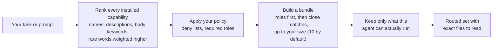

<div align="center">

<h1>
  <picture>
    <source media="(prefers-color-scheme: dark)" srcset="https://raw.githubusercontent.com/Hannay001/lockkeeper/main/docs/lockkeeper-logo-dark.png">
    
  </picture>
</h1>

### The skill router and prompt-injection firewall for AI coding agents

Give **Claude Code, Codex, Cursor** and other AI agents the few skills, MCP servers and tools that fit each task, instead of all of them.<br>
Smaller context window, better tool choices, and no unvetted skill instructions reaching your agent.

[](https://pypi.org/project/lockkeeper/)
[](https://github.com/Hannay001/lockkeeper/actions/workflows/tests.yml)
[](https://www.python.org/downloads/)


[](https://github.com/Hannay001/lockkeeper/blob/main/LICENSE)

[Quickstart](#quickstart) · [Ways to use it](#four-ways-to-use-lockkeeper) · [Benchmark](#proven-on-a-public-benchmark) · [Firewall](#prompt-injection-firewall-for-skills-and-mcp) · [FAQ](#faq) · [Docs](#documentation)

</div>

---

## What is Lockkeeper?

AI coding agents get better with **skills** (`SKILL.md` files), **MCP servers**, plugins and tools. But every one you install adds to what the agent has to read and choose from. With hundreds installed, your context window fills up before work starts, and the agent often picks the wrong skill or none at all.

**Lockkeeper is a local skill router.** It indexes everything installed across all your agents, and for each task it hands the agent a small, complementary set, up to 10 capabilities by default ([you choose the size](https://github.com/Hannay001/lockkeeper/blob/main/docs/CONFIGURATION.md#bundle-size)), with the exact file to read for each. Before anything reaches your agent, its built-in firewall can check skills and live tool calls for prompt injection.

```console
$ lockkeeper route --runtime claude "migrate the auth module to the new token API"

[primary] skill: api-migration
[context] mcp: context7
[integration] tool: mcp__context7__query_docs
[verification] agent: code-reviewer
[support] skill: python-patterns
context savings: loaded 6 of 7,540 eligible capabilities (7,534 kept out of context)
```

<p align="center">
  
</p>

## Why developers use Lockkeeper

- **🎯 Better skill choices.** On a public benchmark of real agent tasks, Lockkeeper ranks a correct skill first **65% of the time among 26,000 real skills** (up from 35%) and **55% among 79,000**, no model required. [See the benchmark](#proven-on-a-public-benchmark).
- **📉 A context window that stays small.** With 58,018 capabilities in the library, a routed task still carries a median of about **8,700 tokens** of skills instead of about 77.5 million. Adding skills to the library doesn't grow your prompt.
- **🛡 Safer skills and plugins.** Scan any skill, plugin or MCP config for hidden instructions and data exfiltration before your agent reads it, and block hostile tool calls live.
- **🔌 Works where you already work.** Automatic routing in Claude Code, an MCP server for Codex, Cursor, Windsurf, Cline and other clients, and a CLI for everything else.
- **🔒 Local, private and dependency-free.** Pure Python standard library. No GPU, API key or cloud service needed. Telemetry is off unless you say yes.

## Quickstart

**1. Install** from [PyPI](https://pypi.org/project/lockkeeper/) (Python 3.11+, macOS, Linux and Windows):

```sh
pipx install lockkeeper     # or: pip install lockkeeper  ·  uv tool install lockkeeper
lockkeeper init             # finds every AI agent on this machine and connects it
```

<sub>Only want the router skill? `npx skills add Hannay001/lockkeeper` installs it for any agent (it needs the `lockkeeper` command too). Prefer not to use a terminal? Paste the prompt in [PROMPT.md](https://github.com/Hannay001/lockkeeper/blob/main/PROMPT.md) into the AI agent you already use; it installs and configures Lockkeeper for you. Working from source? `git clone https://github.com/Hannay001/lockkeeper.git && cd lockkeeper && ./install.sh`</sub>

**2. Index what you have installed:**

```sh
lockkeeper rebuild    # indexes every skill, agent, command, MCP server and plugin it finds
lockkeeper doctor     # shows each agent found and how many skills it has
```

**3. Route a task:**

```sh
lockkeeper route "write unit tests for a python data pipeline"
```

Then pick how your agent should use it, below.

## Four ways to use Lockkeeper

### 1. Route every prompt automatically (Claude Code)

Install the Claude Code plugin (after `pipx install lockkeeper`). Inside Claude Code:

```text
/plugin marketplace add Hannay001/lockkeeper
/plugin install lockkeeper@lockkeeper
```

It adds the routing hook, the MCP server and the router skill in one step. Prefer settings files? `lockkeeper hooks install claude` adds just the hook (use one or the other, not both).

Every prompt you send now reaches Claude Code with a short note naming the installed skills that fit it and the exact files to read. Slash commands and short replies like "thanks" pass through untouched, and the hook never blocks a prompt. Undo with `lockkeeper hooks remove claude`.

Then shrink the list Claude Code loads into every session:

```sh
lockkeeper library move            # shows the plan: which skills move, how many tokens it saves
lockkeeper library move --apply    # moves them to ~/.agents/library; the hook still finds them
lockkeeper library restore --apply # puts them all back
```

Claude Code puts the name and description of every skill in `~/.claude/skills` into each session. Library mode moves them to a folder Lockkeeper indexes but Claude Code doesn't load, so only the skills a prompt needs reach the context. Keep favorites where they are with `--keep NAME`.

### 2. As an MCP server (Codex, Cursor, Windsurf, Cline and any MCP client)

`lockkeeper mcp` gives your agent three tools, `route`, `search` and `audit`, and keeps the index loaded between calls so answers are fast.

```sh
claude mcp add lockkeeper -- lockkeeper mcp          # Claude Code
```

```toml
# Codex: ~/.codex/config.toml
[mcp_servers.lockkeeper]
command = "lockkeeper"
args = ["mcp", "--runtime", "codex"]
```

```json
{ "mcpServers": { "lockkeeper": { "command": "lockkeeper", "args": ["mcp"] } } }
```

<sub>The JSON form works for Cursor (`~/.cursor/mcp.json`), Windsurf, Cline and most other clients. Lockkeeper is also listed in the official MCP Registry (MCP Registry name: `mcp-name: io.github.Hannay001/lockkeeper`).</sub>

### 3. From the command line and scripts

```sh
lockkeeper route --runtime codex "add rate limiting to a REST endpoint"
lockkeeper search "pdf tables"
lockkeeper route --json --stdin < task.txt      # whole prompts, machine-readable output
```

### 4. As a firewall for skills and plugins

```sh
lockkeeper audit ~/Downloads/some-skill --recursive --strict   # exit 2 = hostile
lockkeeper hooks install claude --firewall                      # block hostile tool calls live
```

## Supported agents

| Agent | Skills and tools indexed | How the agent gets its routes |
|---|:-:|---|
| Claude Code | ✓ | Automatically on every prompt (`hooks install claude`), or MCP |
| OpenAI Codex CLI | ✓ | MCP (`lockkeeper mcp`) or CLI |
| Cursor, Windsurf, Cline | ✓ | MCP |
| GitHub Copilot, Gemini CLI, OpenCode | ✓ | MCP |
| Jcode, Hermes | ✓ | MCP or CLI |

Lockkeeper reads the formats you already use: `SKILL.md` Agent Skills, agents and commands in Markdown, plugin manifests, and MCP server configs. The installer also detects agent tools it doesn't know by name.

## Proven on a public benchmark

Routing claims should be measurable. Lockkeeper is tested against **SkillRouter Eval Core**, the public benchmark from the SkillRouter paper ([arXiv:2603.22455](https://arxiv.org/abs/2603.22455)): 75 real agent tasks with known correct skills, hidden among real `SKILL.md` files from public repositories, including 780 deliberately misleading look-alikes.

| | Before this release | **Lockkeeper today** |
|---|--:|--:|
| Correct skill ranked first, 26,000 skills | 34.7% | **65.3%** |
| Correct skill ranked first, 79,141 skills | 25.3% | **54.7%** |
| Needed skills included in the routed set (79k) | 20.6% | **52.1%** |
| Time to route a ~180-word task, 26k skills | 6.5 s | **0.7 s** |

On the full pool, Lockkeeper's standard-library ranker scores between the paper's general-purpose embedding models (Qwen3-Embedding-0.6B at 53.3%, Gemini embedding at 56.0%) and roughly double its BM25 keyword baseline (28.0%), without loading a model. Methods, per-change results and caveats: **[docs/BENCHMARK.md](https://github.com/Hannay001/lockkeeper/blob/main/docs/BENCHMARK.md)**.

Reproduce it yourself (downloads the ~400 MB dataset once):

```sh
python3 scripts/bench_routing.py prepare --home /tmp/lk-bench --size 26000
python3 scripts/bench_routing.py run --home /tmp/lk-bench
```

**Your prompt stays flat as your library grows.** On the 79,141-skill benchmark pool (about 157M tokens of skill text), six everyday tasks each routed to 10 capabilities: a median of about 16,000 tokens even if the agent reads every one, over 99.98% kept out of context. The 26,000-skill pool gave about the same (17,600). Reproduce with `python3 scripts/bench_context_savings.py`.

## How it works


```mermaid
flowchart LR
    T["Your task or prompt"] --> S["Rank every installed capability<br/>names, descriptions, body keywords,<br/>rare words weighted higher"]
    S --> P["Apply your policy<br/>deny lists, required roles"]
    P --> B["Build a bundle<br/>roles first, then close matches,<br/>up to your size (10 by default)"]
    B --> F["Keep only what this<br/>agent can actually run"]
    F --> R["Routed set with<br/>exact files to read"]
```

- **One index for every agent** on your machine, deduplicated, and refreshed automatically when you install, remove or update a skill.
- **Reads what each skill is about**, not just its one-line description: the most distinctive words of every skill's body are indexed at rebuild.
- **Bundles, not long lists.** A route fills complementary roles (primary method, context, integration, verification, support), then tops up with close matches only, never past your bundle size (10 by default, 3 to 20).
- **Optional upgrades, never required:** an embedding sidecar for semantic re-ranking, and a decision-model stage (for example [Laya](https://pypi.org/project/laya/) or a cross-encoder) that starts in shadow mode so you can measure it before trusting it.

## Prompt-injection firewall for skills and MCP

<p align="center">
  
</p>

Skills and plugins are instructions your agent follows. Lockkeeper's scanner finds text that tries to override the agent, commands that send secrets or files to the network, credential-store access, code that decodes and runs hidden payloads, destructive commands, and invisible Unicode, across Markdown, configs and scripts.

- **CI-ready verdicts:** `clean`, `suspect`, `hostile` with exit codes 0, 1, 2.
- **Live protection:** a Claude Code hook blocks hostile tool calls before they run.
- **Evidence:** signed receipts prove what was scanned and that results weren't altered.
- **Optional:** dependency CVE checks against osv.dev, and a second-pass LLM review.

Full details: **[docs/FIREWALL.md](https://github.com/Hannay001/lockkeeper/blob/main/docs/FIREWALL.md)**.

## How Lockkeeper compares

| | Routes each task | Skills, MCP, plugins and tools, across agents | Uses what a skill's body says | Injection firewall | Needs a model or GPU |
|---|:-:|:-:|:-:|:-:|:-:|
| Loading every skill into context | ✗ | – | ✓, at a huge token cost | ✗ | no |
| Built-in skill lists (name and description only) | agent guesses | one agent | ✗ | ✗ | no |
| Learned skill routers (e.g. SkillRouter, 1.2B parameters) | ✓ | skills only | ✓ | ✗ | yes |
| MCP server managers | ✗ | MCP only | – | ✗ | no |
| Skill security scanners | ✗ | ✗ | ✓ | ✓ | some |
| **Lockkeeper** | **✓** | **✓** | **✓** | **✓** | **no** |

## FAQ

### How do I stop too many skills from filling my Claude Code context window?
Run `lockkeeper hooks install claude`, then `lockkeeper library move --apply`. The first makes each prompt arrive with the few skills that fit it; the second moves your skills out of `~/.claude/skills` into a library Lockkeeper indexes but Claude Code doesn't load, so their descriptions stop filling every session. `lockkeeper library move` without `--apply` shows the plan first, `--keep NAME` leaves favorites in place, and `lockkeeper library restore --apply` undoes it.

### Does Lockkeeper work with MCP servers?
Both ways. It indexes the MCP servers and tools your agents have configured and routes to them, and it is itself an MCP server (`lockkeeper mcp`) that Codex, Cursor, Windsurf, Cline and other clients can call.

### How do I check a skill from GitHub for prompt injection before installing it?
Run `lockkeeper audit path/to/skill --recursive --strict`. A `hostile` verdict (exit code 2) means don't install it. See [docs/FIREWALL.md](https://github.com/Hannay001/lockkeeper/blob/main/docs/FIREWALL.md).

### Does Lockkeeper send my prompts or code anywhere?
No. Routing, indexing and auditing run locally. The only network features are opt-in: the osv.dev dependency check, the LLM scan, remote decision providers, and the optional embedding sidecar, which downloads its model once.

### Is there telemetry?
Only if you say yes. `lockkeeper init` and `lockkeeper hooks install` ask once, in your terminal (never in scripts or CI), and `lockkeeper telemetry on|off` changes your answer at any time. It shares anonymous daily counts (which commands ran and how fast), never prompts, skill names or file paths, and `DO_NOT_TRACK=1` always turns it off. See [docs/TELEMETRY.md](https://github.com/Hannay001/lockkeeper/blob/main/docs/TELEMETRY.md).

### Is Lockkeeper free to use?
Yes, for you and your company, including at work and on commercial projects: use it, change it and share it. What the [Functional Source License](https://fsl.software/) (FSL-1.1-ALv2) doesn't allow is offering Lockkeeper, or a product built from it, to others as a commercial product or service that competes with it. Each release becomes Apache 2.0 two years after it ships, and versions up to 1.2.0 remain under the MIT license.

### Do I need a GPU, an API key or an embedding model?
No. The core uses only the Python standard library. Embeddings and decision models are optional add-ons.

### How many skills can Lockkeeper handle?
It's tested with up to 79,141 skills. At typical sizes (hundreds to a few thousand) routing and re-indexing take well under a second to a few seconds.

### Will it choose worse skills than my agent would on its own?
Measure it: `scripts/bench_routing.py` runs the public benchmark, and `scripts/eval_decision.py` evaluates labeled tasks from your own history.

## Documentation

| Guide | What's in it |
|---|---|
| [Configuration](https://github.com/Hannay001/lockkeeper/blob/main/docs/CONFIGURATION.md) | All commands, projects and policy packs, freshness, long prompts, hooks, MCP, optional models |
| [Firewall](https://github.com/Hannay001/lockkeeper/blob/main/docs/FIREWALL.md) | What the scanner detects, verdicts, receipts, live hooks |
| [Benchmark](https://github.com/Hannay001/lockkeeper/blob/main/docs/BENCHMARK.md) | Methods, full results, comparison with published routers, caveats |
| [Telemetry](https://github.com/Hannay001/lockkeeper/blob/main/docs/TELEMETRY.md) | Exactly what opt-in telemetry collects, and how to turn it off |
| [Architecture](https://github.com/Hannay001/lockkeeper/blob/main/docs/ARCHITECTURE.md) | How the index, router and firewall fit together |
| [Roadmap](https://github.com/Hannay001/lockkeeper/blob/main/ROADMAP.md) | What's shipped and what's next |

## Contributing

Issues, ideas and pull requests are welcome. To run the tests:

```sh
HOME="$(mktemp -d)" python3 -m unittest discover -s tests -p "test_*.py" -t .
```

By submitting a pull request, you agree to license your contribution under the project's [license](https://github.com/Hannay001/lockkeeper/blob/main/LICENSE).

Found a security issue or a way past the firewall? Please report it privately per [SECURITY.md](https://github.com/Hannay001/lockkeeper/blob/main/SECURITY.md).

---

<div align="center">

Built and maintained by **[Himanshu (@Hannay001)](https://github.com/Hannay001)** · [Functional Source License (FSL-1.1-ALv2)](https://github.com/Hannay001/lockkeeper/blob/main/LICENSE)

**If Lockkeeper saves you context or catches something nasty, a ⭐ helps other developers find it.**

</div>
